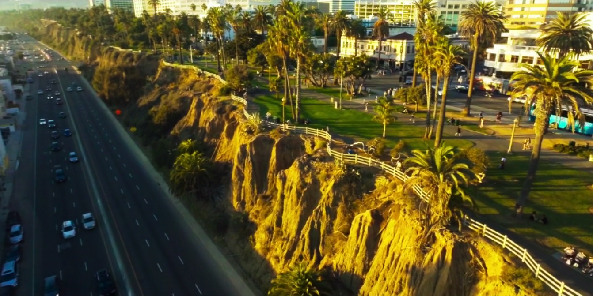
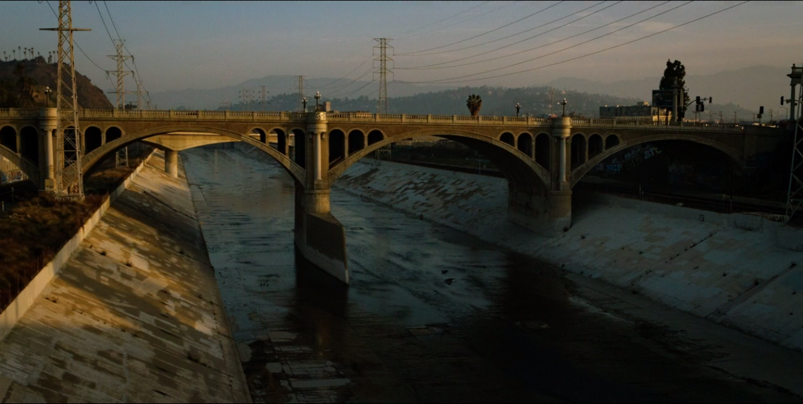
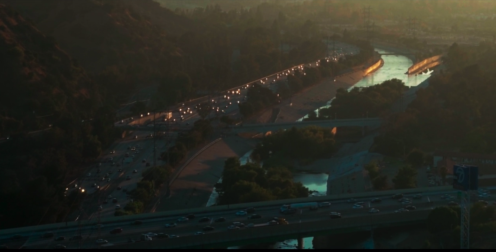

# Los Santos vs Los Angeles

Comparison of Los Angeles as shot in Goliath, Season 1 vs. Los Santos in GTA V

There is no doubt that the model of LAX in the game GTA V is fairly accurate. However, when I started watching Season 1 of Goliath on Amazon, I was blown away by other areas such as Vespucci and Vespucci Beach (Venice and Venice Beach), Del Perro Heights, and the Del Perro Heights Pier.

### Episode 1, Of Mice and Men

### Episode 8, Citizens United

We don't usually approach from the air in this direction, but this closely matches the Los Santos Freeway near the race track where Lester has a warehous.

### Other Media References

* [The Satire of GTA V (Grand Theft Auto V) – Wisecrack Edition](https://youtu.be/E85feLp-gx8)
* [Game Theory: Are GTA V Cops Racist? (Grand Theft Auto V)](https://youtu.be/ZXpfsYiG8Dc)
* [California's Skeleton In The Closet: The Salton Sea](https://youtu.be/wCYcSbCR6z4)
